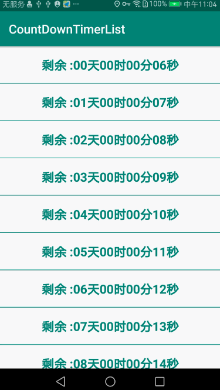

# CountDownTimerList
CountDownTimerList 单线程（HanderThread）实现列表倒计时



-

builb.gradle
```
implementation 'com.zyp.timerlist:timerlist:1.0.1'
```

pom.xml
```
<dependency>
  <groupId>com.zyp.timerlist</groupId>
  <artifactId>timerlist</artifactId>
  <version>1.0.1</version>
  <type>pom</type>
</dependency>

```


- 列表倒计时（支持RecyclerView和ListView）

```
// Adapter 中使用示例 ，一般在Adapter构造函数中初始化XListCountDownTimer

  class TimeDownAdapter extends BaseAdapter<TimeEntry> {

          private final XListCountDownTimer mXTimeCounter;

          public TimeDownAdapter() {
              mXTimeCounter = new XListCountDownTimer();
          }

          @Override
          protected BaseViewHolder<TimeEntry> createViewHolder(View view) {
              return new TimeDownViewHolder(view, mXTimeCounter);
          }

          @Override
          protected int itemLayout() {
              return R.layout.item_layout;
          }

          class TimeDownViewHolder extends BaseViewHolder<TimeEntry> {
              private XListCountDownTimer mXTimeCounter;

              @BindView(R.id.tv_down_time)
              TextView tvDownTime;

              public TimeDownViewHolder(View itemView, XListCountDownTimer xTimeCounter) {
                  super(itemView);
                  this.mXTimeCounter = xTimeCounter;
                  ButterKnife.bind(this, itemView);
              }

              @Override
              public void bindData(TimeEntry timeEntry) {
                  final long time = timeEntry.getTime();
                  final long id = timeEntry.getId();

                  //ViewWrapper的 第一个参数 id必须唯一，类似每隔商品的订单id ，第二个参数View可以是任何View及ViewGroup
                  mXTimeCounter.running(new XListCountDownTask(new ViewWrapper(id, tvDownTime)) {
                      @Override
                      protected boolean updateView(ViewWrapper viewWrapper) {
                          final TextView tvDownTime = (TextView) viewWrapper.getView();

                          long remainTime = time - SystemClock.elapsedRealtime();
                          if (remainTime < 0) {
                              tvDownTime.setText("剩余 :" + DataUtil.formatDownTime(0));
                              return false;
                          }
                          final String downTime = DataUtil.formatDownTime(remainTime);
                          tvDownTime.setText("剩余 :" + downTime);
                          return true;
                      }

                  });
              }
          }
      }

```

- 单个倒计时

```
 // 倒计时在UI线程中执行
 XCountDownTimer xCountDownTimer = new XCountDownTimer(30 * 1000, 1000) {
    @Override
    protected void onTick(long millisUntilFinished) {
        Log.e(TAG, "millisUntilFinished : " + millisUntilFinished / 1000);
    }

    @Override
    protected void onFinish() {
        Log.e(TAG, "onFinish" + " , thread:" + Thread.currentThread().getName());
    }
};
xCountDownTimer.start();

// 倒计时在子线程中执行
 XCountDownTimer xCountDownTimer = new XCountDownTimer(30 * 1000, 1000, false) {
    @Override
    protected void onTick(long millisUntilFinished) {
        Log.e(TAG, "millisUntilFinished : " + millisUntilFinished / 1000);
    }

    @Override
    protected void onFinish() {
        Log.e(TAG, "onFinish" + " , thread:" + Thread.currentThread().getName());
    }
};
xCountDownTimer.start();

```
